# Hey there :wave: 

I'm Nate, a team leader and software entineer using Github for lots of projects! Check out my profile and recent activity to see what I'm working on.

<picture>
  <source
    srcset="./profile/stats-dark.svg"
    media="(prefers-color-scheme: dark)" />
  <source
    srcset="./profile/stats-light.svg"
    media="(prefers-color-scheme: light), (prefers-color-scheme: no-preference)" />
  
</picture>

## Current Projects and Activity

- 🎮 For fun I'm building and writing on my [blog](https://github.com/fuzzzerd/NoteToSelf). I also enjoy and some basic game development using Phaser and MonoGame.
- 🌱 I’m always tinkering and learning new things.
- 💬 Ask me about [FMData](https://fmdata.io), [SharpFM](https://github.com/fuzzzerd/SharpFM), [Quicktext](https://quicktext.app) or any of my [public repos](https://github.com/fuzzzerd?tab=repositories).

## The Numbers

While GitHub shows a lot of my work, its not everything, though I'd say its a good representative sample.

## About me

I started programming with my father in qBASIC in the early 1990's and progressed to Visual Basic 4 on Windows 3.1 (yes, the 16-bit version.) I started using Microsoft Access and Classic ASP to build websites. I built a web based out-of-game Leader Board for my friends and myself by extracting the data from the game servers log files. This set me on the path to programming, and I've never looked back. Through high school and college I studied programming, graduating from Northeastern Illinois University with a degree in Computer Science.

In order to facilitate my hobby of gaming, I spent a lot of time learning how to run a game server in my basement. I spent some time throughout my career as a sys-admin as well. I use the skills and knowledge gained through those experiences to develop and design robust, scalable, and resilient software systems.

## Get in touch

<!--
**fuzzzerd/fuzzzerd** is a ✨ _special_ ✨ repository because its `README.md` (this file) appears on your GitHub profile.
-->
